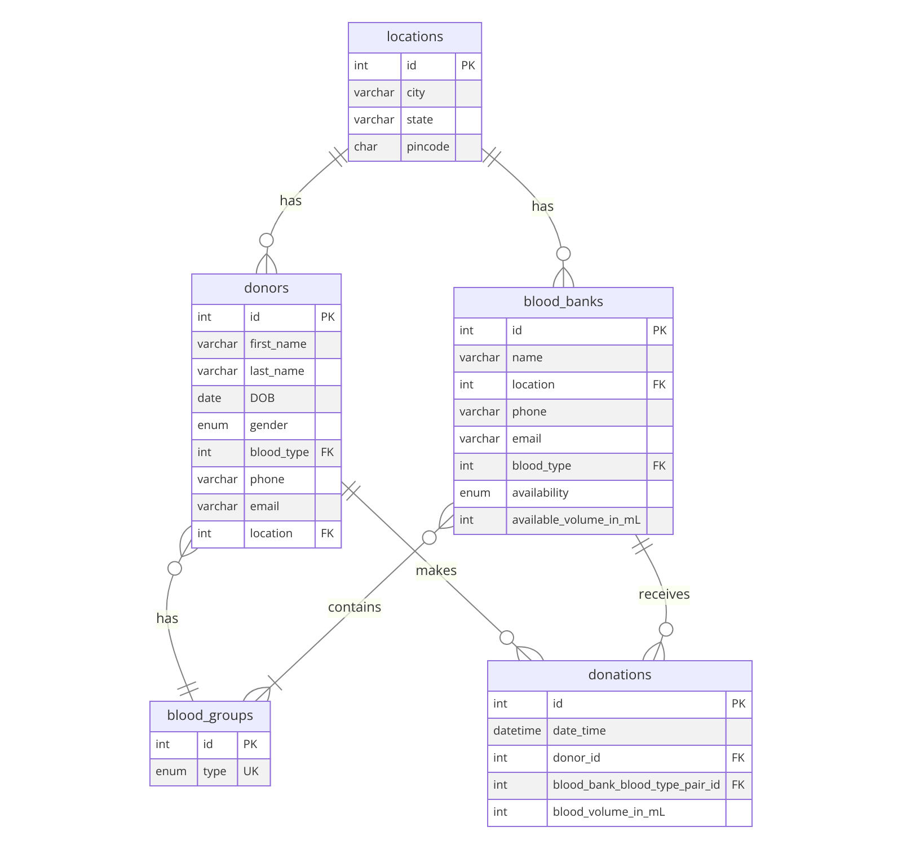

# Design Document

By AAYUSH GOSWAMI

Video overview: <[CS50 SQL Final Project Submission](https://youtu.be/60XCa-kLt8M)>

## Scope

The database for **Centralized Blood Donors Organization in India** includes all the entities that are required to track the details of the blood donors, blood banks and blood donations conducted all over India. As such, included in the databases scope is:

* **Blood Groups**, includes all the blood types that are commonly found in India.

* **Locations**, all over India, accurate to the Pincode of the location.

* **Donors**, including the basic identifying and contact details.

* **Blood Banks**, include the basic contact and location details.

* **Donations**, of blood by donors at different blood banks at different locations.

Out of scope are the details like the actual address of the donors and the blood banks, details of past medical history of the donors and rare blood gruops that are not very commonly found in India.

## Functional Requirements

This database will support:

* **CRUD** operations for the officials of the Organization (via the `'root'` user).

* **Tracking** the details of all the blood donations occurred al over India.

* **Read** access of **`VIEWS`** to General Public (via the `'public'` user created by the `schema.sql` file).

Note that in this iteration, the provision for addition of details to the database and Read access of the **`TABLES`** by the general public is not supported.

## Representation

Entities are captured in MySQL tables with the following schema.

### Entities

The database includes the following entities:

#### Blood Groups

The `blood_groups` table contains:

* `id`, which specifies the unique id of each blood type as an `INT`. It has a `PRIMARY KEY` constraint with `AUTO_INCREMENT` property applied.

* `type`, which is the actual type of the blood, which is determined by the presence and/or absence of different antigens in the blood. It is stored in the table as an `ENUM` data type and has `UNIQUE` and `NOT NULL` constraints applied.

#### Locations

The `locations` table contains:

* `id`, which specifies a unique id of each of the **locations** all over India. It is of data type `INT` and has `PRIMARY KEY` constraint and `AUTO_INCREMENT` property applied.

* `city`, specifies the **City** component of the location. It stores the name of the city as a `VARCHAR(50)` data type and has `NOT NULL` constraint applied.

* `state`, specifies the **State** in which the location is. It stores the name of the state as a `VARCHAR(50)` data type and has `NOT NULL` constraint applied.

* `pincode`, which is the **Pincode** of the location. It stores the pincode as a `CHAR(6)` datatype, as a valid pincode in India is strictly a 6 digit number. It has `NOT NULL` constraint applied to it.

#### Donors

The `donors` table contains:

* `id`, which specifies a unique id of each of the **blood donors** all over India. It is of data type `INT` and has `PRIMARY KEY` constraint and `AUTO_INCREMENT` property applied.

* `first_name`, which stores the **first name** of the donor as `VARCHAR(32)` data type and has `NOT NULL` constraint applied to it.

* `last_name`, which stores the **last name** of the donor as `VARCHAR(32)` data type and has `NOT NULL` constraint applied to it.

* `DOB`, which stores the **date of birth** of the donor as `DATE` data type and has `NOT NULL` constraint applied to it.

* `gender`, stores the **gender** of the donor as `ENUM` data type, with the options of `'Male'`, `'Female'` and `'Other'` and has the `NOT NULL` constraint applied to it.

* `blood_type`, which cntains the `id` of the **blood type** of the donor as an `INT` and has `NOT NULL` constraint applied to it. This column thus has a `FOREIGN KEY` constraint applied on it which references the `id` column of the `blood_groups` table.

* `phone`, contains the **contact number** of the donor stored as a `VARCHAR(12)` data type. It has a `NOT NULL` constraint applied to it.

* `email`, contains the **email ID** of the donor, if the donor provides one during registration, as a `VARCHAR(100)` data type.

* `location`, which cntains the `id` of the **location** of the donor as an `INT` and has `NOT NULL` constraint applied to it. This column thus has a `FOREIGN KEY` constraint applied on it which references the `id` column of the `locations` table.

#### Blood Banks

The `blood_banks` table contains:

* `id`, which specifies a unique id of each of the **blood bank - blood type** pair all over India. It is of data type `INT` and has `PRIMARY KEY` constraint and `AUTO_INCREMENT` property applied.

* `name`, which stores the **name** of the blood bank as `VARCHAR(128)` data type and has `NOT NULL` constraint applied to it.

* `location`, which cntains the `id` of the **location** of the blood bank as an `INT` and has `NOT NULL` constraint applied to it. This column thus has a `FOREIGN KEY` constraint applied on it which references the `id` column of the `locations` table.

* `phone`, contains the **contact number** of the blood bank stored as a `VARCHAR(12)` data type. It has a `NOT NULL` constraint applied to it.

* `email`, contains the **email ID** of the blood bank as a `VARCHAR(100)` data type. It has a `NOT NULL` constraint applied to it.

* `blood_type`, which cntains the `id` of the **blood type** of the blood bank - blood type pair as an `INT` and has `NOT NULL` constraint applied to it. This column thus has a `FOREIGN KEY` constraint applied on it which references the `id` column of the `blood_groups` table.

* `availability`, whch specifies the **availability** of a particular blood type in that blood bank. The value is stored as `ENUM` data type, with the options of `'Available'` and `'Unavailable'` and has the `NOT NULL` constraint applied to it.

* `available_volume_in_mL`, which specifies how much amount of blood of a particular blood type is available in a particular blood bank, in `mL`. The data is stored as `INT` datatype with a `DEFAULT` value of **'0'**.

#### Donations

The `donations` table contains:

* `id`, which specifies a unique id of each of the **blood donations** occurred all over India. It is of data type `INT` and has `PRIMARY KEY` constraint and `AUTO_INCREMENT` property applied.

* `date_time`, which contains the date-timestamp of the collection of the blood in that particular instance of donation. The data is stored as `DATATIME` data type and has a `DEFAULT` value of `CURRENT_TIMESTAMP`.

* `donor_id`, which cntains the `id` of the **donor** of the blood as an `INT` and has `NOT NULL` constraint applied to it. This column thus has a `FOREIGN KEY` constraint applied on it which references the `id` column of the `donors` table.

* `blood_bank_blood_type_pair_id`, which cntains the `id` of the **blood bank - blood type pair**, where the donation of a particular blood type occurred, as an `INT` and has `NOT NULL` constraint applied to it. This column thus has a `FOREIGN KEY` constraint applied on it which references the `id` column of the `blood_banks` table.

* `blood_volume_in_mL`, which contains the **amount** of blood collected in that particular instance of blood donation in **mL**. The data is stored as `INT` and has `NOT NULL` constraint applied to it.

#### Views

Following views are also created in the database for public use:
* `donor_details` --> Displays the full expanded details of a donor by joining the `donors`, `blood_groups` and `locations` tables on related columns.

* `blood_bank_inventory` --> Displays the full expanded details of a donor by joining the `blood_banks`, `blood_groups` and `locations` tables on related columns.

* `donations_details` --> Displays the full expanded details of a donations by joining `donations`, `donors`, `blood_groups` and `blood_banks` tables on related columns.

* `available_blood` --> Dispays the availability of each type of blood in blood banks all over the country by joining the `blood_banks` and `blood_groups` tables on related columns.

#### Triggers

The database also contains a `TRIGGER` named `after_donation_insert`, which `UPDATES` the relevant field (i.e. the `available_volume_in_mL` column) of the `blood_banks` table, on `INSERTION` of new data in the `donations` table.

#### User Creation

The `schema.sql` file also create a user named as `public` which doesnot require any password to login. This is done to test the functionality of the **access to the Views** granted to the `public` user.

### Relationships

The below **ER** *(entity relationship)* **Diagram** describes the relationships among the entities in the database.

As detailed by the diagram:

* **donors has blood_groups**:
  * Each donor can be associated with one and only one blood group but a blood group can be associated with zero or many donors, as there can be no to multiple donors of a particular blood group. The `blood_type` attribute in the `donors` table is a foreign key referencing the `id` attribute in the `blood_groups` table.

* **locations has donors**:
  * Each location can have zero or many donors. The `location` attribute in the `donors` table is a foreign key referencing the `id` attribute in the `locations` table.

* **locations has blood_banks**:
  * Each location can have zero or many blood banks. The `location` attribute in the `blood_banks` table is a foreign key referencing the `id` attribute in the `locations` table.

* **blood_banks contains blood_groups**:
  * Each blood bank can be associated with zero or many blood groups and vice versa (there can be one to multiple blood groups' blood available in a blood bank, blood of a particular blood group can be present in no to many blood banks). The `blood_type` attribute in the `blood_banks` table is a foreign key referencing the `id` attribute in the `blood_groups` table.

* **donors makes donations**:
  * Each donor can make zero or many donations. The `donor_id` attribute in the `donations` table is a foreign key referencing the `id` attribute in the `donors` table.

* **blood_banks receives donations**:
  * Each blood bank can receive zero or many donations. The `blood_bank_blood_type_pair_id` attribute in the `donations` table is a foreign key referencing the `id` attribute in the `blood_banks` table.

## Optimizations

As per the frequently performed queries listed in the `queries.sql` file, it is common for the Officials of the Organization (`root`) and the General Public (`public`) to search for donor details and blood bank details based on the location an the type of the requirement of blood.\
Also the Officials need to keep track of the Blood Donation details based on the `id` od the donors and the blood banks. Keeping these situations in mund, the following indices are created:

* **`idx_blood_type`** on `type` column of the *`blood_groups`* table.

* **`idx_location`** on `city`, `state` and `pincode` columns of the *`locations`* table.

* **`idx_donor_blood_location`** on `blood_type` and `location` columns of the *`donors`* table.

* **`idx_blood_bank_location_blood`** on `location` and `blood_type` columns of the *`blood_banks`* table.

* **`idx_donations_donor_blood_bank`** on `donor_id` and `blood_bank_blood_type_pair_id` columns of the *`donations`* table.

## Limitations

* The current schema does **NOT** cover the addition of or search by the actual address of the donors and blood banks. The location of the blood donors and blood banks is accurate to the **pincode** of it.

* The database contains only the **most commonly found** blood groups in India. It does **NOT** include **rarer blood groups** that are not commonly found in India.

* The provision for **creating** and **updating** data in the database through the **public account** is **NOT** supported in this version of schema.

* The `blood_banks` table does **NOT** provide a unique id for each of the **blood banks alone**, as in this table the unique id is provided on the **blood bank - blood type** pair. So for this reason a blood bank name and location and contact details may not be referred by a unique id.
